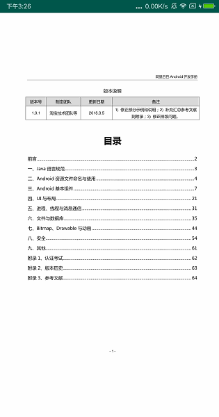
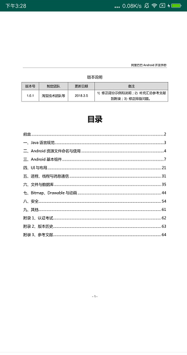
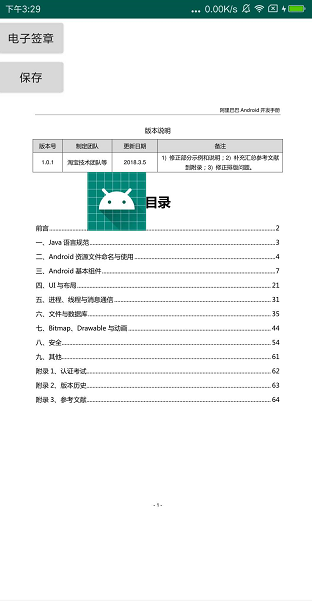
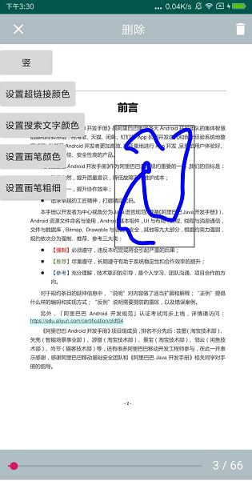

# PdfViewerDemo
基于LonelyPluto/PdfViewerDemo项目 [LonelyPluto/PdfViewerDemo](https://github.com/LonelyPluto/PdfViewerDemo) ，由于原作者未提供基于mupdf的定制化代码导致无法构建armv8版本so库，补充该定制化部分代码。
支持各处理器的so库可在此下载[so文件](https://github.com/liumeng1201/PdfViewerDemo/tree/master/app/src/main/jniLibs)，可直接引用原作者的开源库，并将需要的so添加至自己的项目中并配置build.gradle文件来指定要打包进apk的so文件。

mupdf基于1.9版本，相关的源码已打包见 mupdf-1.9-platform-android.zip 压缩包，已包含相关改动(修改批注笔迹颜色、笔迹粗细)，可参考源码中 platform\android\viewer\ReadMe.txt 文件进行编译(在Centos7系统下，安装openjdk8、make、gcc之后即可正常编译so)。

pdf阅读器，基于MuPDF开发，可横竖切换浏览、多种批注功能、电子签章\
PdfViewerDemo is developed within the [mupdf](https://mupdf.com/downloads/) project.
# Screenshots
        \
          

# Features
* 显示pdf
* 支持横竖滑动
* 动态改变标注颜色和画笔颜色
* 支持插入图片
# How do I use?
pdf-viewer is available through JCenter. To be able to use this library in your project, add the following dependency to your build.gradle file:
~~~ 
dependencies{
	implementation 'com.lonelypluto:pdf-viewer:1.0.7'
 }
 ~~~
 Simple use cases will look something like this:
 
~~~xml
<com.artifex.mupdfdemo.MuPDFReaderView
        android:id="@+id/mupdfreaderview"
        android:layout_width="match_parent"
        android:layout_height="match_parent"
        />

MuPDFReaderView muPDFReaderView = (MuPDFReaderView)findViewById(R.id.mupdfreaderview);
MuPDFCore muPDFCore = new MuPDFCore(this, filePath);
muPDFReaderView.setAdapter(new MuPDFPageAdapter(this, muPDFCore));
~~~
# 特别说明
本来写个库可以方便使用，但是总有一些人跟我要.so文件甚至要.so文件的源码，这里就不多说了，最近一年太忙也没有太多时间和精力去扩展新的功能，我把.so文件放到项目的根目录libs文件夹中，希望对有需要的人提供一点帮助吧
